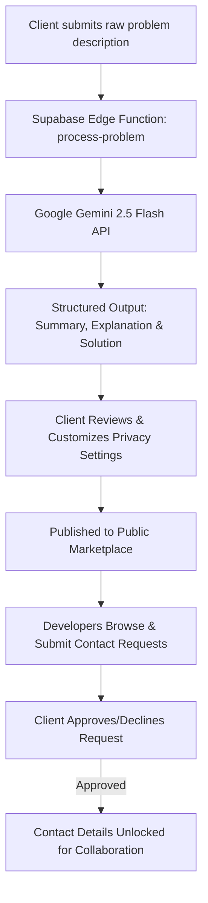

# AIstride Network 🚀

> **Note**: This repository contains the working **Demonstration / Prototype** built according to the original project proposal for **IDEALIZE 2026** (organized by AIESEC in University of Moratuwa) by **Team Astrynex**.

AIstride Network is an intelligent bridge connecting business owners (Clients) facing operational or technical challenges with skilled software developers and AI solution architects.

By harnessing **Google Gemini AI** via serverless **Supabase Edge Functions**, AIstride Network turns rough, unformatted problem descriptions into structured, step-by-step technical blueprints ready for developer collaboration.

---

## 🔀 Pivots & Differences from Original Proposal

While the overall vision remains aligned with the IDEALIZE 2026 proposal, key architectural and functional pivots were introduced during prototype development to enhance privacy, speed up user workflows, and refine user experience:

1. **Connection Mechanism (Permission-Gated Contact Requests vs. Real-Time Chat)**:
   - *Proposal*: Built-in real-time chat system immediately after listing.
   - *Demo Implementation*: Implemented a **Permission-Gated Contact Request System**. Developers request contact, and clients review and **approve or decline** requests before email/phone details are revealed.
   - 💬 **Future Full Build Note**: The **built-in real-time chat function** powered by Supabase Realtime will be fully integrated in the upcoming **Full Production Build Version**.

2. **Streamlined AI Problem Submission Workflow**:
   - *Proposal*: Multi-turn conversational chat with an LLM agent prior to brief generation.
   - *Demo Implementation*: Streamlined into a single-step, high-speed input interface where raw problem descriptions are instantly structured into a complete blueprint (Summary, Resolution Steps, Explanation) by **Google Gemini 2.5 Flash**, reducing user friction while leaving full edit capability to the client.

3. **Styling & Design System**:
   - *Proposal*: Proposed using Tailwind CSS.
   - *Demo Implementation*: Utilizes custom **Vanilla CSS** with CSS variables and custom components to deliver a lightweight, dark-themed, bespoke user experience.

---

## 🌟 Key Features

- **🤖 AI-Powered Problem Blueprinting**: Turn plain-English, unstructured problem descriptions into structured solutions complete with summaries, technical explanations, and actionable resolution steps using **Google Gemini 2.5 Flash**.
- **🏬 Public Problem Marketplace**: A central hub where clients post validated business challenges and developers browse opportunities for collaboration.
- **👤 Dual-Role Profiles**: Dedicated workflows and profile fields for both **Clients** (seeking solutions) and **Developers** (offering engineering services with portfolio links).
- **🔐 Permission-Gated Contact Workflows**: Granular privacy controls allowing clients to approve or decline contact requests from developers before sharing personal contact details.
- **⚡ Serverless Edge Infrastructure**: High-performance backend driven by **Supabase Edge Functions** (Deno) for secure API execution without client-side key exposure.


---

## 🔄 How It Works



1. **Sign Up & Profile Creation**: Users register via Supabase Auth and configure their user profile as either a Client or Developer.
2. **Submit a Problem**: Clients enter a rough explanation of their problem.
3. **AI Processing**: Supabase Edge Function sends the text to Google Gemini 2.5 Flash, generating a structured JSON response containing:
   - Concise Problem Summary
   - Step-by-Step Resolution Blueprint
   - In-depth Technical Explanation
4. **Review & Publish**: Clients review the generated blueprint and select contact display settings (Show Email/Phone or Require Contact Request).
5. **Connect & Collaborate**: Developers browse posted problems, request contact, and upon client approval, establish direct communication to build the solution.

---

## 🛠️ Technology Stack

| Layer | Technology | Description |
| :--- | :--- | :--- |
| **Frontend Framework** | [React 19](https://react.dev/) | Modern UI component rendering |
| **Language** | [TypeScript](https://www.typescriptlang.org/) | Type safety across application and backend edge functions |
| **Build Tool & Server** | [Vite 8](https://vitejs.dev/) | Fast HMR development server and bundler |
| **Routing** | [React Router DOM v7](https://reactrouter.com/) | Client-side routing with navigation protection |
| **UI Feedback** | [React Hot Toast](https://reacthottoast.com/) | Interactive toast notifications |
| **Backend & Database** | [Supabase](https://supabase.com/) | PostgreSQL database, Row Level Security, & Authentication |
| **Edge Compute** | [Supabase Edge Functions](https://supabase.com/docs/guides/functions) | Serverless Deno functions for API integrations |
| **AI Intelligence** | [Google Gemini 2.5 Flash](https://ai.google.dev/) | Generative AI model for problem analysis and solution mapping |
| **Code Linting** | [Oxlint](https://oxc.rs/docs/guide/usage/linter.html) | High-performance Rust-based JavaScript/TypeScript linter |

---

## 🗄️ Database Schema Overview

- `profiles`: Stores user profile data including `user_type` (`client` \| `developer`), `full_name`, `bio`, `contact_email`, `phone`, and developer portfolio links (`github_url`, `linkedin_url`, `website_url`).
- `problems`: Stores posted problem entries including `title`, `summary`, `solution`, `explanation`, `user_id`, and privacy flags (`show_email`, `show_phone`, `contact_request`).
- `contact_requests`: Tracks collaboration requests between developers and clients with status states (`pending`, `approved`, `declined`).

---

## 🚀 Getting Started

### Prerequisites

- [Node.js](https://nodejs.org/) (v18+ recommended)
- [npm](https://www.npmjs.com/)
- A [Supabase](https://supabase.com/) project with Database and Edge Functions configured
- A [Google Gemini API Key](https://aistudio.google.com/)

### 1. Clone the Repository & Install Dependencies

```bash
git clone https://github.com/Sevindu-Damsara/AIstride-Network.git
cd AIstride-Network
npm install
```

### 2. Environment Setup

Create a `.env` file in the root directory:

```env
VITE_SUPABASE_URL=https://your-supabase-project-id.supabase.co
VITE_SUPABASE_PUBLISHABLE_KEY=your-supabase-publishable-key
```

Set the Gemini API Key secret for Supabase Edge Functions:

```bash
npx supabase secrets set GEMINI_API_KEY=your-google-gemini-api-key
```

### 3. Deploy Edge Function (Optional / Admin)

```bash
npx supabase functions deploy process-problem
```

### 4. Run Development Server

```bash
npm run dev
```

Open [http://localhost:5173](http://localhost:5173) in your browser.

---

## 📜 Scripts Available

- `npm run dev` - Starts local Vite development server
- `npm run build` - Runs TypeScript typecheck and builds production bundle
- `npm run lint` - Runs Oxlint linter check
- `npm run preview` - Previews production build locally

---

## 🗺️ Future Roadmap (Full Build Version)

The following features and enhancements are planned for the upcoming full build release:

- [ ] **💬 Built-in Real-Time Chat System**: Direct in-app messaging between clients and developers using Supabase Realtime subscriptions.
- [ ] **🤖 Multi-turn AI Assistant**: Interactive conversational interface to refine problem descriptions before marketplace listing.
- [ ] **🔍 Advanced Search & Filter**: Filtering problems by technical stack, complexity, domain, and contact status.
- [ ] **⭐ Reviews & Developer Ratings**: Reputation system for verified solution deliveries.

---

## 📄 License

This project is currently open-source though it will be licensed later.


